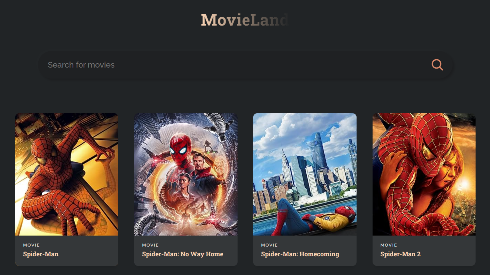

# [Movieland React App](https://movieland-react-template.netlify.app/)

## Description

This is a single-page web application for searching movies and series built using [React](https://react.dev/). 

It allows users to type in a keyword into the search bar and displays a dynamically updated list of all results relative to the specified keyword. This project was completed to gain familiarity with using React to make API calls. 

## Usage

- Click the search bar
- Type a keyword into the search bar (for example: "spider-man").
- Hover over any of the results to view its release date. 

## Credits

- This project was completed as practice following guidance provided by a 72-minute [YouTube tutorial](https://youtu.be/b9eMGE7QtTk) uploaded by [JavaScript Mastery](https://www.youtube.com/@javascriptmastery) on the 4th of March 2022, titled “React JS Full Course 2023 | Build an App and Master React in 1 Hour”.
- The styling used in this project was sourced from [Adrian Hajdin's Movie App Github repository](https://gist.github.com/adrianhajdin/997a8cdf94234e889fa47be89a4759f1).
- The API used in this project is [OMDb API](http://www.omdbapi.com).
- This project was bootstrapped with [Create React App](https://github.com/facebook/create-react-app).

