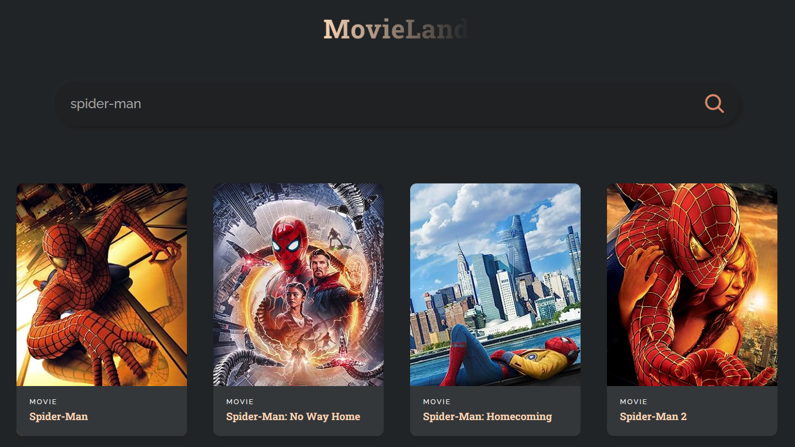

# Movieland React App

## Description

This is a single-page web application for searching movies and series built using [React](https://react.dev/). 

It allows users to type in a keyword into the search bar and displays a dynamically updated list of all results relative to the specified keyword. This project was completed with the aim of becoming familiar with using React to make API calls. 

## Installation

- Fork this repository
- Clone your forked repository
- Open your forked repository on your local computer in your preferred Text Editor
- In the project directory, run `npm start` in the terminal. 

This runs the app in the development mode.\
Open [http://localhost:3000](http://localhost:3000) to view it in your browser.

## Usage

- Type in a keyword into the search bar (for example: "spider-man").
- Hover over any of the results to view its release date. 

## Screenshot

## Credits

- This project was completed as practice in accordance with guidance provided by a 72-minute [YouTube tutorial](https://youtu.be/b9eMGE7QtTk) uploaded by [JavaScript Mastery](https://www.youtube.com/@javascriptmastery) on the 4th of March 2022, titled “React JS Full Course 2023 | Build an App and Master React in 1 Hour”. 
- The API used in the project was sourced from [OMDb API](http://www.omdbapi.com).
- This project was bootstrapped with [Create React App](https://github.com/facebook/create-react-app).

